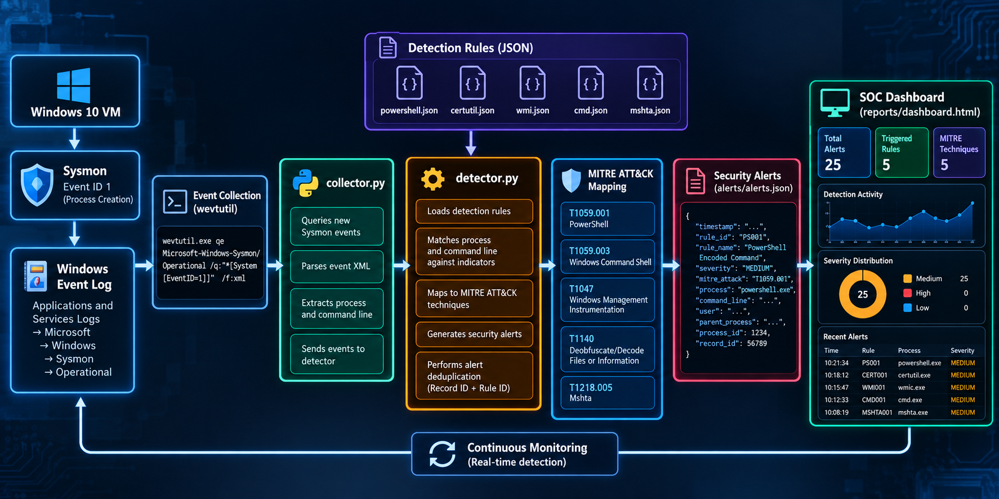
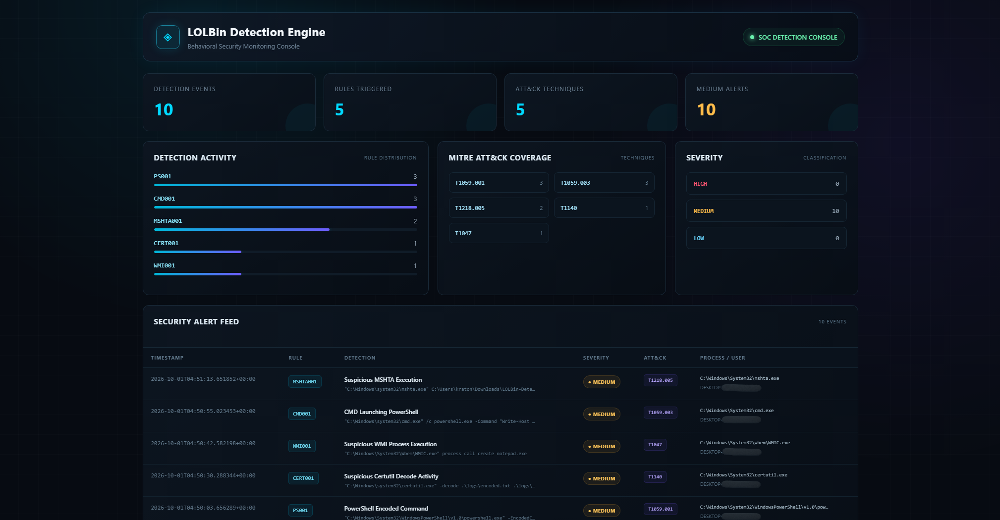

# Behavioral Detection Engine for Living-off-the-Land Attacks

A Windows-based behavioral detection engine that monitors Sysmon process creation events, identifies suspicious Living-off-the-Land Binary (LOLBin) activity, maps detections to MITRE ATT&CK techniques, and presents security alerts through a SOC-style dashboard.

---

## Overview

Attackers can abuse legitimate Windows utilities to execute commands, decode content, and perform other actions without relying on traditional malware files.

This project focuses on detecting suspicious behavior associated with commonly abused Windows tools by analyzing process creation telemetry rather than relying on file signatures.

The detection engine:

- Collects Sysmon Process Creation events
- Parses Windows Event Log data using `wevtutil`
- Applies configurable JSON-based detection rules
- Generates structured security alerts
- Maps detections to MITRE ATT&CK techniques
- Prevents duplicate alerts for the same event and rule
- Stores alerts persistently
- Provides a SOC-style web dashboard
- Supports continuous monitoring

---

## Project Objective

The objective is to build a behavioral detection engine capable of identifying fileless and LOLBin-based activity from Windows event logs using behavioral heuristics and MITRE ATT&CK mappings.

This project was developed as a SOC Analyst / Detection Engineering portfolio project.

---

## Architecture



### Detection Workflow

```text
Windows 10 VM
      ↓
    Sysmon
      ↓
Windows Event Log
      ↓
   wevtutil
      ↓
 collector.py
      ↓
Detection Rules
      ↓
 detector.py
      ↓
MITRE ATT&CK Mapping
      ↓
Security Alerts
      ↓
alerts.json
      ↓
SOC Dashboard
```

---

## SOC Dashboard

The project includes a SOC-style dashboard for visualizing detected activity, MITRE ATT&CK coverage, severity, and security alerts.



The current demonstration dashboard contains:

- 10 detection events
- 5 triggered detection rules
- 5 MITRE ATT&CK techniques
- 10 medium-severity alerts
- Detection activity by rule
- MITRE ATT&CK coverage
- Severity classification
- Security alert feed

---

## Technologies Used

| Technology | Purpose |
|---|---|
| Python | Detection engine and event processing |
| Windows 10 | Detection and telemetry environment |
| Sysmon | Process creation telemetry |
| `wevtutil` | Windows Event Log collection |
| JSON | Detection rule configuration and alert storage |
| HTML/CSS/JavaScript | SOC dashboard |
| MITRE ATT&CK | Detection technique mapping |
| VMware | Isolated lab environment |
| VS Code | Development environment |

---

## Detection Coverage

The current detection engine contains rules for PowerShell, Certutil, WMI, CMD, and MSHTA activity.

| Rule ID | Detection | Indicator | Severity | MITRE ATT&CK |
|---|---|---|---|---|
| PS001 | PowerShell Encoded Command | `-EncodedCommand` | Medium | T1059.001 |
| CERT001 | Suspicious Certutil Decode Activity | `-decode` | Medium | T1140 |
| WMI001 | Suspicious WMI Process Execution | `process call create` | Medium | T1047 |
| CMD001 | CMD Launching PowerShell | `powershell` | Medium | T1059.003 |
| CMD002 | CMD Launching Certutil | `certutil` | Medium | T1059.003 |
| CMD003 | CMD Launching MSHTA | `mshta` | Medium | T1059.003 |
| CMD004 | CMD Launching Regsvr32 | `regsvr32` | Medium | T1059.003 |
| MSHTA001 | Suspicious MSHTA Execution | `.hta` | Medium | T1218.005 |

Detection rules are stored as individual JSON files inside the `rules/` directory.

---

## Demonstrated Detection Scenarios

The engine was tested in an isolated Windows lab using safe, non-destructive commands.

### 1. PowerShell Encoded Command

Detects PowerShell execution using the `-EncodedCommand` parameter.

**Rule:** `PS001`

**MITRE ATT&CK:** `T1059.001 – PowerShell`

The encoded command is treated as a behavioral indicator requiring investigation and does not automatically establish malicious intent.

---

### 2. Certutil Decode Activity

Detects use of `certutil.exe` with the decode operation.

**Rule:** `CERT001`

**MITRE ATT&CK:** `T1140 – Deobfuscate/Decode Files or Information`

The test used a user-created text file and a harmless encoded value.

---

### 3. WMI Process Creation

Detects WMI-based process creation using `wmic.exe`.

**Rule:** `WMI001`

**MITRE ATT&CK:** `T1047 – Windows Management Instrumentation`

The demonstration used WMI to launch a harmless Windows application.

---

### 4. CMD Launching PowerShell

Detects `cmd.exe` launching PowerShell.

**Rule:** `CMD001`

**MITRE ATT&CK:** `T1059.003 – Windows Command Shell`

The CMD detection was tuned to reduce false positives from ordinary CMD activity.

For example, a benign command such as:

```text
cmd.exe /c "echo Normal CMD Activity"
```

does not trigger the PowerShell detection rule.

---

### 5. MSHTA Execution

Detects execution of an HTA file through `mshta.exe`.

**Rule:** `MSHTA001`

**MITRE ATT&CK:** `T1218.005 – Mshta`

The demonstration used a harmless HTA file created specifically for the lab.

---

## Alert Deduplication

The engine implements alert deduplication using the combination of:

```text
Sysmon Record ID + Detection Rule ID
```

This prevents the same Sysmon event from repeatedly generating the same alert during continuous polling.

Separate process creation events are still treated as separate detections.

---

## Alert Format

Alerts are stored in:

```text
alerts/alerts.json
```

Each alert contains information such as:

```text
Timestamp
Rule ID
Rule Name
Severity
MITRE ATT&CK Technique
Reason
Process
Command Line
User
Parent Process
Process ID
UTC Time
Record ID
```

This provides useful context for SOC-style investigation and triage.

---

## Project Structure

```text
LOLBin-Detection-Engine/
│
├── collector.py
├── detector.py
├── dashboard.py
├── config.json
├── README.md
├── .gitignore
│
├── alerts/
│   └── alerts.json
│
├── docs/
│   └── images/
│       ├── architecture.png
│       └── soc-dashboard.png
│
├── reports/
│   └── dashboard.html
│
└── rules/
    ├── powershell.json
    ├── certutil.json
    ├── wmi.json
    ├── cmd.json
    └── mshta.json
```

Local test logs and temporary files are excluded from Git using `.gitignore`.

---

# Setup

## Requirements

- Windows 10/11
- Python 3.x
- Sysmon
- Administrator privileges for Sysmon installation
- VS Code or another code editor
- VMware or another isolated virtualization platform

The project was developed and tested in a Windows 10 virtual machine using VMware.

---

## 1. Install Sysmon

Download Sysmon from the official Microsoft Sysinternals distribution and place it in a local tools directory.

Install Sysmon with the project configuration:

```powershell
.\Sysmon64.exe -accepteula -i .\sysmon-config.xml
```

After modifying the configuration, reload it with:

```powershell
.\Sysmon64.exe -c .\sysmon-config.xml
```

The project uses Sysmon Process Creation telemetry.

---

## 2. Verify Sysmon

Open:

```text
Event Viewer
    → Applications and Services Logs
    → Microsoft
    → Windows
    → Sysmon
    → Operational
```

The detection engine primarily consumes:

```text
Event ID 1 — Process Create
```

---

## 3. Clone the Repository

```powershell
git clone https://github.com/jamijaswanth07/lolbin-detection-engine.git
```

Enter the project directory:

```powershell
cd lolbin-detection-engine
```

---

# Running the Detection Engine

## Continuous Monitoring

Start the continuous collector:

```powershell
python collector.py
```

The collector:

1. Queries Sysmon Process Creation events
2. Parses the event XML
3. Loads detection rules
4. Matches process and command-line indicators
5. Generates alerts
6. Performs alert deduplication
7. Saves alerts to `alerts/alerts.json`

The collector continuously polls for new events.

---

## Single Event Detection

The standalone detector can be executed with:

```powershell
python detector.py
```

This performs a single detection cycle against the latest relevant Sysmon process creation event.

---

## Generate the Dashboard

Run:

```powershell
python dashboard.py
```

The generated dashboard is saved to:

```text
reports/dashboard.html
```

Open the HTML file in a browser to view the SOC dashboard.

---

# Detection Rule Format

Rules are stored as JSON files.

Example:

```json
{
    "rules": [
        {
            "id": "PS001",
            "name": "PowerShell Encoded Command",
            "description": "Detects PowerShell execution using the EncodedCommand parameter.",
            "process": "powershell.exe",
            "indicator": "-encodedcommand",
            "severity": "MEDIUM",
            "mitre_attack": "T1059.001"
        }
    ]
}
```

This design allows additional behavioral rules to be added without changing the core detection logic.

---

# Testing Approach

Testing was performed using a controlled Windows virtual machine.

The test methodology focused on safe demonstrations of suspicious-looking behavior rather than real malware.

Tested behaviors included:

```text
PowerShell encoded command
Certutil decoding
WMI process creation
CMD → PowerShell execution
MSHTA → HTA execution
```

The project also tested rule tuning against normal CMD activity to reduce unnecessary alerts.

---

# Demonstration Results

The final demonstration dataset contains alerts generated from multiple controlled test executions.

The dashboard records detection activity across:

```text
PS001
CMD001
MSHTA001
CERT001
WMI001
```

The resulting alerts demonstrate that the engine can:

- Detect multiple LOLBin behaviors
- Associate detections with MITRE ATT&CK techniques
- Preserve event context
- Distinguish repeated process creation events
- Avoid duplicate alerts for the same event/rule combination
- Present detections through a SOC-style interface

---

# MITRE ATT&CK Coverage

Current mappings include:

| Technique | Description |
|---|---|
| T1059.001 | PowerShell |
| T1059.003 | Windows Command Shell |
| T1047 | Windows Management Instrumentation |
| T1140 | Deobfuscate/Decode Files or Information |
| T1218.005 | Mshta |

These mappings provide a standardized way to describe the behaviors detected by the engine.

---

# Security Considerations

This project is intended for defensive security research and controlled laboratory environments.

The demonstrations use harmless commands and user-created test files.

No real malware is required to run the detection engine.

The presence of an indicator such as PowerShell `-EncodedCommand` should be treated as a detection signal requiring investigation rather than automatic proof of malicious activity.

---

# Limitations

The current implementation has several limitations:

- Detection is primarily based on process creation telemetry.
- Rules currently use straightforward process and command-line indicators.
- Advanced behavioral correlation is not yet implemented.
- Network-based correlation is not currently part of the detection engine.
- Detection accuracy has not been evaluated against a large labeled dataset.
- The current implementation is designed as a lightweight lab/portfolio detection engine rather than a production SIEM/EDR replacement.

---

# Future Enhancements

Potential improvements include:

- Sigma rule support
- More LOLBin detection rules
- Parent-child process correlation
- Network telemetry correlation
- File creation correlation
- DNS activity correlation
- Risk scoring
- Alert severity escalation
- SQLite or PostgreSQL alert storage
- REST API integration
- SIEM integration
- Automated incident timelines
- Advanced behavioral correlation
- False-positive analytics
- Detection performance evaluation using a larger test dataset

---

# Project Status

**Status: Functional Prototype**

Implemented:

- [x] Sysmon telemetry collection
- [x] Windows Event Log parsing
- [x] Continuous monitoring
- [x] JSON detection rules
- [x] LOLBin behavioral detection
- [x] MITRE ATT&CK mapping
- [x] Alert generation
- [x] Alert deduplication
- [x] Persistent alert storage
- [x] SOC dashboard
- [x] Detection testing
- [x] CMD false-positive tuning
- [x] GitHub repository
- [x] Architecture documentation
- [x] SOC dashboard documentation

---

## Author

**Jami Jaswanth**

Cybersecurity | SOC | Detection Engineering | Threat Detection

GitHub:
https://github.com/jamijaswanth07
